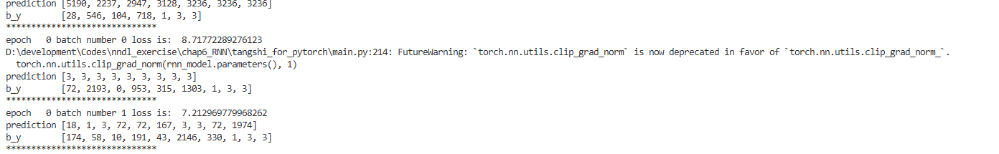
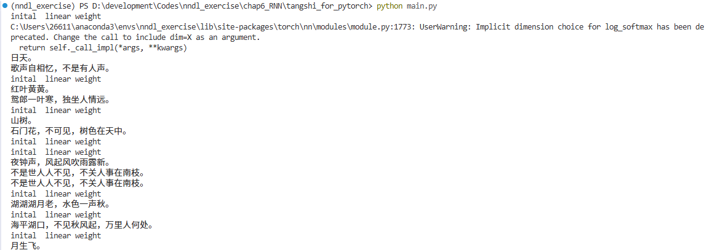

## 循环神经网络诗歌生成实验报告

### 1. 实验任务概述

本次实验基于《神经网络与深度学习》第 6 章“循环神经网络（RNN）”，完成中文唐诗自动生成任务。  

本报告基于 **PyTorch 版本** 。

---

### 2. 模型原理：RNN、LSTM、GRU

#### 2.1 RNN（Recurrent Neural Network）

- **基本思想**  
  RNN 通过在时间维度上的“循环”连接，使当前时刻的隐状态 $h_t$ 既依赖当前输入 $x_t$，也依赖上一时刻的隐状态 $h_{t-1}$，从而实现对序列数据的建模。

- **典型更新公式**  
  $$
  h_t = f(W_{xh}x_t + W_{hh}h_{t-1} + b_h)
  $$
  其中 $f$ 通常为 $\tanh$ 或 ReLU，$W_{xh}, W_{hh}$ 为可学习参数。

- **优点与不足**
  - 优点：结构简单，能处理任意长度的序列，适合文本、语音等时序数据；
  - 不足：在序列较长时，容易出现梯度消失/爆炸，导致对长距离依赖的建模能力不足。

#### 2.2 LSTM（Long Short-Term Memory）

- **引入动机**  
  针对传统 RNN 难以捕捉长期依赖的问题，LSTM 在结构中加入 **细胞状态 $c_t$** 和多个门（gate），通过门控机制有选择地记忆和遗忘信息。

- **核心结构**
  - 遗忘门 $f_t$：决定遗忘多少历史信息；
  - 输入门 $i_t$：决定写入多少新的候选信息；
  - 候选细胞状态 $\tilde c_t$：当前时刻的新信息；
  - 输出门 $o_t$：从细胞状态中读取多少信息到隐状态。

- **关键公式（简化）**
  $$
  \begin{aligned}
  f_t &= \sigma(W_f[x_t, h_{t-1}] + b_f) \\
  i_t &= \sigma(W_i[x_t, h_{t-1}] + b_i) \\
  \tilde c_t &= \tanh(W_c[x_t, h_{t-1}] + b_c) \\
  c_t &= f_t \odot c_{t-1} + i_t \odot \tilde c_t \\
  o_t &= \sigma(W_o[x_t, h_{t-1}] + b_o) \\
  h_t &= o_t \odot \tanh(c_t)
  \end{aligned}
  $$

- **特点**  
  通过“高速通道”$c_t$ 和门控机制，LSTM 能在较长序列上保持重要信息，显著缓解梯度消失问题，是目前最常用的序列建模结构之一。

#### 2.3 GRU（Gated Recurrent Unit）

- **设计思路**  
  GRU 是 LSTM 的简化版本，在保持门控思想的同时，减少了门的数量和参数量，计算更高效。

- **核心结构**
  - 更新门 $z_t$：在旧状态 $h_{t-1}$ 和候选状态 $\tilde h_t$ 之间进行加权；
  - 重置门 $r_t$：控制旧状态参与候选状态计算的程度。

- **关键公式（简化）**
  $$
  \begin{aligned}
  z_t &= \sigma(W_z[x_t, h_{t-1}]) \\
  r_t &= \sigma(W_r[x_t, h_{t-1}]) \\
  \tilde h_t &= \tanh(W[x_t, r_t \odot h_{t-1}]) \\
  h_t &= (1 - z_t)\odot h_{t-1} + z_t \odot \tilde h_t
  \end{aligned}
  $$

- **特点**  
  相比 LSTM，GRU 结构更简单、参数更少，训练速度更快，在许多任务上效果与 LSTM 相当甚至更好。

#### 2.4 三者对比小结

- **RNN**：结构最简单，但长序列时容易梯度消失，长期依赖建模能力弱；
- **LSTM**：通过门控和细胞状态有效解决长期依赖问题，但参数和计算量较大；
- **GRU**：折中方案，结构简洁、速度快，性能通常接近 LSTM。

---

### 3. 诗歌生成过程（PyTorch 版本）

#### 3.1 数据预处理流程

数据处理位于 `tangshi_for_pytorch/main.py`，主要步骤如下：

1. **读入与过滤**
   - 从 `poems.txt` 中按行读取，每行预期格式为：
     - `标题:内容`
   - 使用 `process_poems1()` 解析：
     - 用 `line.strip().split(':')` 将标题和内容分开；
     - 去除空格，过滤掉含下划线、括号、书名号等特殊符号的诗句；
     - 过滤掉长度过短（< 5）或过长（> 80）的诗句；
     - 对于解析异常的行（`split` 失败）打印一次 `"error"`，并跳过，不影响后续训练。

2. **添加起止标记**
   - 定义：
     - `start_token = 'G'`
     - `end_token = 'E'`
   - 对每首诗构造新字符串：
     - `content = start_token + content + end_token`
   - 得到处理后的诗句列表 `poems`。

3. **构建词表与索引映射**
   - 统计所有诗句中字的频率，按照词频从高到低排序；
   - 建立：
     - `word_int_map`：字符 → 索引；
     - `vocabularies`：索引 → 字符；
   - 将每首诗映射为索引序列，得到 `poems_vector`。

4. **构造训练样本与 batch**
   - 使用 `generate_batch(batch_size, poems_vec, word_to_int)` 生成训练数据：
     - 对每个索引序列 `row`：
       - 输入序列 `x` 为原序列；
       - 目标序列 `y` 为 `x` 向右平移一位，最后一个位置重复末尾元素，示例：
         - `x = [6, 2, 4, 6, 9]`  
         - `y = [2, 4, 6, 9, 9]`
     - 将多个样本堆叠成 `x_batches` 和 `y_batches`，供后续训练循环使用。

#### 3.2 模型结构与补全部分

模型定义在 `tangshi_for_pytorch/rnn.py`，本次主要补全了：

1. **词向量层 `word_embedding`**
   - 使用 `nn.Embedding(vocab_length, embedding_dim)` 将字索引映射到稠密向量；
   - 初始化使用 [-1, 1] 区间的均匀分布，提升训练初期收敛性。

2. **双层 LSTM（补全 1）**
   - 在 `RNN_model.__init__` 中定义：
     - 输入维度：`embedding_dim`；
     - 隐层维度：`lstm_hidden_dim`；
     - 层数：2；
     - `batch_first=True`，输入输出形状均为 `(batch, seq_len, feature)`。
   - 完成代码类似：
     - `self.rnn_lstm = nn.LSTM(input_size=embedding_dim, hidden_size=lstm_hidden_dim, num_layers=2, batch_first=True)`

3. **前向传播中 LSTM 调用（补全 2）**
   - 在 `forward(self, sentence, is_test=False)` 中：
     - 使用 `word_embedding_lookup` 将输入索引序列转换为 embedding；
     - 调整形状为 `(1, seq_len, embedding_dim)`；
     - 手动构造两层的初始隐状态 `h0` 和细胞状态 `c0` 为全零张量；
     - 将 `(batch_input, (h0, c0))` 送入 `self.rnn_lstm`，得到 `output`；
     - 展平为 `(seq_len, lstm_dim)`，再经过全连接层 `fc` 和 `LogSoftmax` 得到输出分布；
     - 训练时返回整句所有时间步的分布，测试（生成）时只取最后一个时间步的分布，用于预测下一个字。

#### 3.3 训练过程

1. **训练设置**
   - 数据：`poems.txt` 处理后的全部诗句；
   - 批次大小：`BATCH_SIZE = 100`；
   - 优化器：`RMSprop`，学习率 `lr = 0.01`；
   - 损失函数：`NLLLoss`（负对数似然，对应模型输出的 `LogSoftmax`）；
   - 训练轮数：`for epoch in range(30)`，共 **30 个 epoch**；
   - 每个 batch 内对 100 首诗逐条循环前向和反向计算，将 loss 累加后取平均。

2. **训练过程输出**
   - 每个 batch：
     - 打印部分预测结果和真实标签索引；
     - 输出当前 `epoch`、`batch` 号和平均 loss：
       - 如：`epoch  0 batch number 0 loss is:  8.71...`
   - 每隔一定 batch 间隔保存一次模型参数：
     - `torch.save(rnn_model.state_dict(), './poem_generator_rnn')`
   - 在本次实验中，日志最后几行类似：
     - `epoch   29 batch number 347 loss is:  5.83...`  
     表明 30 个 epoch（从 0 到 29）已全部训练完成。

#### 3.4 生成过程

1. **加载模型与词表**
   - 使用同样的预处理函数重新加载 `poems.txt`，得到 `word_int_map` 与 `vocabularies`；
   - 实例化 `word_embedding` 和 `RNN_model`，再通过
     - `rnn_model.load_state_dict(torch.load('./poem_generator_rnn'))`
     加载训练好的参数。

2. **按指定开头字生成**
   - 设定 begin word，如：`"日"`、`"红"`、`"山"`、`"夜"`、`"湖"`、`"海"`、`"月"`；
   - 初始 `poem = begin_word`，循环：
     - 将当前已生成的整句映射为索引序列；
     - 输入模型，获取最后一个位置对下一字的概率分布；
     - 选取概率最大的字（`argmax`）作为新字，拼接到 `poem` 后面；
     - 当生成到结束标记 `E` 或长度超过设定阈值（如 30）时停止。

3. **最终输出示例**

训练结束后，在终端以指定开头字进行了生成，输出摘录如下（仅展示诗句）：

- `日天。`
- `歌声自相忆，不是有人声。`
- `红叶黄黄。`
- `鸳郎一叶寒，独坐人情远。`
- `山树。`
- `石门花，不可见，树色在天中。`
- `夜钟声，风起风吹雨露新。`
- `不是世人人不见，不关人事在南枝。`
- `湖湖湖月老，水色一声秋。`
- `海平湖口，不见秋风起，万里人何处。`
- `月生飞。`

---

### 4. 生成结果与截图说明

1. **训练过程截图**
    - 训练过程截图如下：
  
    

2. **生成诗歌截图**
   - 在训练完成后，如果再次运行 `main.py`（可以把 `run_training()` 注释掉，仅执行生成部分），终端会输出多句诗歌；
   - 生成结果截图如下：
 
   

---

### 5. 实验总结

- **模型效果**  
  经过约 30 个 epoch 的训练，模型能够生成结构合理、语气接近日常唐诗风格的句子。尽管仍存在重复（如“湖湖湖”）和语义不完全通顺的地方，但整体在韵律、词汇搭配上已经具备一定“诗意”。

- **优点与不足**
  - 优点：
    - LSTM 能较好捕捉长距离依赖，使得整句诗在语义上保持一定连贯性；
    - 基于字符级建模，词表规模较小，容易训练和泛化。
  - 不足：
    - 生成策略采用贪心 `argmax`，多样性不足且容易陷入重复；
    - 未引入押韵、对仗等结构性约束，生成诗歌在格律上仍显随意。

- **改进方向**
  - 使用采样或温度控制的 softmax，而不是纯粹的 `argmax`，增加生成多样性；
  - 引入更复杂的模型（如双向 LSTM、注意力机制、Transformer）；
  - 显式建模诗歌的句式和押韵规则，例如强制分句、在句尾指定韵脚等。

本次实验中，我通过补全 PyTorch 代码、完成训练与生成过程，较系统地理解和实践了 RNN/LSTM 在自然语言生成任务中的应用。